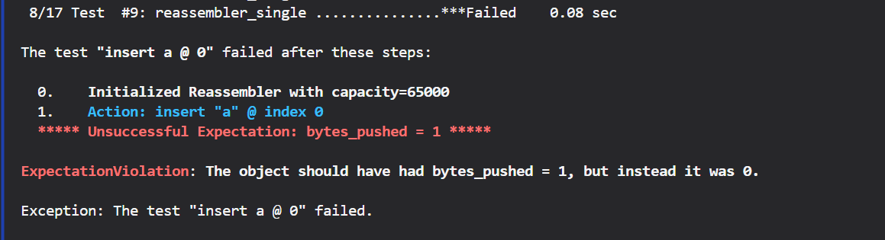
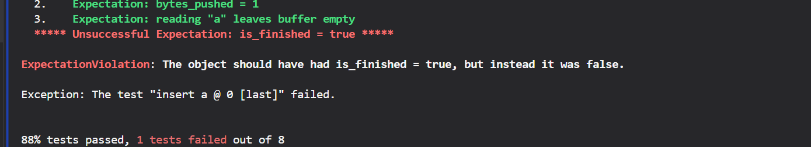
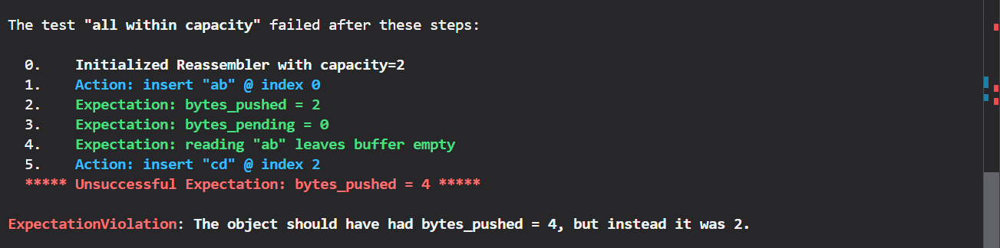
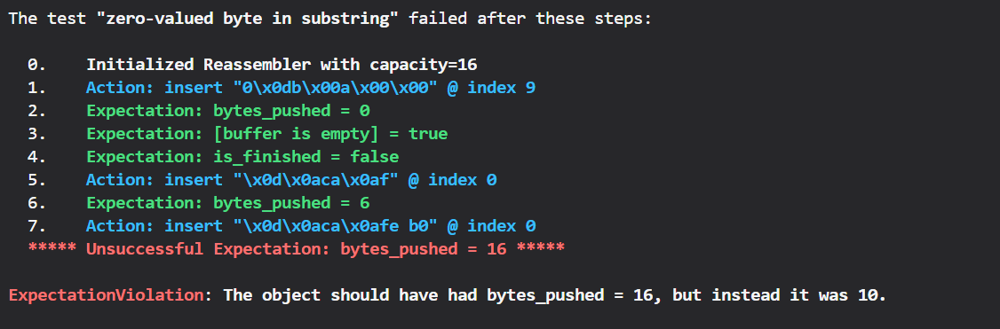
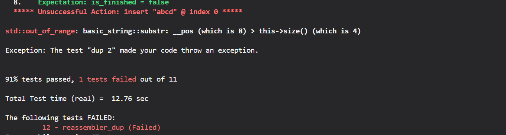

# cs144 问题记录

## Lab1

1. CS144编译要求，
* 项目中使用的代码审查工具-Werror=effc++ 强制要求将成员变量初始化放在成员初始化列表中
* 成员变量构造函数中初始化的顺序要和在类中的声明顺序一致

2.  5 - byte_stream_one_write (Timeout) AddressSanitizer:DEADLYSIGNAL

问题定位：因为在merge远程仓库的分支之前没有出现这个问题，顺利通过check0，怀疑是merge引入的问题，回退到merge之前的版本多次测试，发现这个问题是间歇性出现的。大概是1/2的概率。怀疑是代码问题，苦寻无果，困扰良久。
原因：由gcc引起，参见[stackoverflow问题](https://stackoverflow.com/questions/77894856/possible-bug-in-gcc-sanitizers)
解决方法：1. 禁用地址空间布局随机化 (echo 0 | sudo tee /proc/sys/kernel/randomize_va_space)
         2. 更新 gcc libs (pacman -S gcc-libs)

3. reassembler_single: The object should have had bytes_pushed = 1, but instead it was 0.

原因：substr(size_t pos, size_t counts)，pos:子串的起始位置，counts:字串的长度

4. reassebbler_single: The object should have had is_finished = true, but instead it was false.

原因：当 Reassembler 重组写入完成的时候，没有关闭 bytestream 
解决方法：添加变量 end_byte_index 标记字节流的结束位置，Reassembler重组写入完成时，关闭bytestream。因为end_byte_index类型是 unint64_t,不能初始化为-1，所以使用一个bool类型的变量 is_eof 标记end_byte_index是否有效

5. reassembler_cap: The object should have had bytes_pushed = 4, but instead it was 2.

原因：first_unacceptable_index的更新时机问题：只在把数据push到ByteStream后更新了 first_unacceptable_index，但是在insert函数不执行期间，ByteStream buffer的数据可能被读取，available_capacity的值可能更新，所以需要在insert函数的开始更新 first_unacceptable_index。
解决方法：在insert函数的开始更新 first_unacceptable_index。

6. 调试过程中发现在Reassembler的Insert中对插入数据为空字符串情况的处理有冗余：在插入数据为空的情况下，还是会进行storge,push操作，而且这种情况下，即使output_.writer()已经关闭，还是会进行push操作。

7. reassembler_seq: The object should have had bytes_pushed = 16, but instead it was 10.

原因：Insert中，storge结束后，在循环push的过程中, 以下查找代码会遇到一种无法处理的情况：storge_buffer中存在这样一个字符串：包含next_byte_index，但是这个字符串的first_index小于next_byte_index_，因此查找的时候会错过
``` 
    auto search = buffer.find(next_byte_index_);
    if(search == buffer.end()){
      break;
    }
```
解决方法：遍历storged_buffer，寻找first_index < next_byte_index_ 的字符串，对其做处理
这段遍历相当臃肿，改良思路
    1. stroge_buffer插入的时候添加判断，对重叠的字符串做处理
    2. 选用更合适的数据结构替换map.

8. 注意到问题：reassembler.cc:44
```
    to_storged = data.substr(next_byte_index_ - first_index,std::min(data.size(),first_unacceptable_index_ - first_index));
```
这里的data.size()应当替换为 first_index+data.size()-next_byte_index_(以下记作n)
    * 使用data.size()，substr中count的长度可能会超过字符串的最大长度，不过substr对这种情况能够正确处理。
    *  n <= data.size(), 对first_unacceptable_index > n 的情况，如果使用data.size()，有可能data.size() > m > n，本来应当取n，在这种情况下，取的是data.size()的值。 
修改后遇到问题：对`first_index + data.size() < next_byte_index_`的情况，`first_index + data.size() - next_byte_index_`的值是负数，会溢出变成一个很大的值，影响了min函数的返回值
    
解决方法：在前面对这种情况添加判断